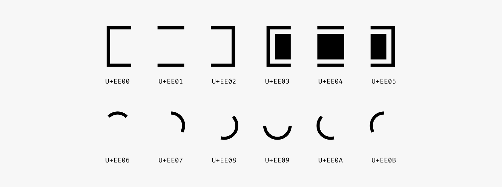
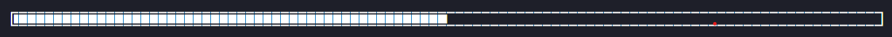

[🇺🇸/🇬🇧 version](../README.MD)
# Overview

Este projeto providencia um modulo para criar barras de carregamento e spinners usando os símbolos especiais da fonte [fira code](https://github.com/tonsky/FiraCode).




## Barra de carregamento

Este projeto providencia uma função para gerar barras de carregamento:

``` python
generate_loading_bar(
    current_value = 50, # Quanto progresso
    total_value = 100,  # De quanto?
    bar_length = 100    # Opcional, o padrão é 100
    )
```

este código irá gerar uma bela barra de carregamento:

Para melhores resultados ative ligaturas de fonte.

### Como usar

Caso você tenha menos experiência, é assim que você faz a barra ser atualizada ao invéz de escrever uma nova linha, isto é um exemplo de uso:
``` python
for i in range(1, 100000):

    print(f'\r{generate_loading_bar(i, 100000, 100)}', end='')

```
O \r é chamado de retorno de carruagem (carriage return) ele retorna o "cursor" da escrita de volta ao início da linha, o nome é em referência à maquinas de escrever.

No fim do print o padrão é o python adicinar um simbolo de nova linha (\n) ao final da linha, alterando este comportamento padrão e usando o returno de carruagem podemos fazer este loop escrever uma linha, voltar para o início e escrever novamente.


## Spinner de carregamento

Este projeto também providencia um spinner de carregamento para que sua barra de carregamento não fique solitária.

Para este você não necessáriamente precisa de ligaturas ativadas mas aí para que usar Fira Code?

### Uso

O uso aqui é basicamente dar o iterador à função e de quantas em quantas iterações o spinner deve ser atualizado
``` python
for i in range(0, 100000):
    print(f'\r{generate_spinner(i, 2000)}', end='')
print("\rsuccess!")  # Retornar a carruagem novamente para apagar o spinner